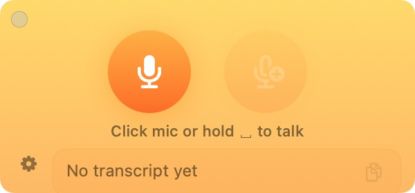

# ASRBar

> 一个常驻顶层的 macOS 小浮窗，把你的声音通过 [Qwen3-ASR](https://huggingface.co/Qwen/Qwen3-ASR-0.6B) + vLLM 实时转写成文字。一个 Swift 文件，没有 Xcode 工程。

简体中文 · [English](README.md)

<p align="center">
  
</p>

ASRBar 永远悬浮在所有窗口之上。点一下麦克风（或按住 **Space**）→ 说话 → 松开，转写结果会自动复制到剪贴板，随时可以粘贴到任何地方。

  

## 为什么做这个

最近觉得使用 Claude Code 写代码，打字很累，但是自带的好像只能识别英文。想了下千问出了个识别音频的模型，也想看看大模型做语音的效果如何，就随手做了这个工具。然后又不想开浏览器这种笨重的服务，就让 Cloud Code 直接写了个 Mac 原生的 app。

## 功能

- **左右两个麦克风。** 左麦 = 全新转写；右麦（`+`）= 追加到上一次结果之后，可以分段连续录一段长文。
- **按住 Space 说话。** 像对讲机一样按住录、松开转写。如果已有上一段结果，默认自动续录。
- **结果卡片自动伸缩。** 转写文字多了卡片自己变长、清空时缩回。顶边保持不动，窗口不会跳来跳去。
- **结果可直接编辑。** 错字现场改，改完的内容才是被复制的内容。
- **录音时实时声波** 在当前麦克风周围扩散，一眼能看出有没有真的录到声音。
- **自动语言检测。** Qwen3-ASR 自己判断语种，不需要 system prompt，也不用切语言。
- **常驻浮窗。** 加入所有 Space，全屏应用上面也看得见。

## 工作原理

```
┌─────────────────────┐    16 kHz 单声道 WAV   ┌──────────────────────┐
│  ASRBar (SwiftUI)   │  ───────────────────▶ │  vLLM + Qwen3-ASR    │
│  AVAudioRecorder    │  base64 → audio_url   │  /v1/chat/completions│
│  NSPanel, 浮窗      │  ◀───────────────────  │                      │
└─────────────────────┘     转写文本           └──────────────────────┘
```

客户端走的是 OpenAI 兼容的 `chat/completions`：Qwen3-ASR 把音频当作 user 消息里唯一的 `audio_url` content。模型返回 `language XX <asr_text>...</asr_text>`，ASRBar 在显示/复制之前把外层标签剥掉。

## 环境要求

- macOS 13.0 或更新（Apple Silicon 或 Intel）
- Xcode Command Line Tools（`xcode-select --install`）— 提供 `swiftc`、`codesign`、`iconutil`、`sips`
- 一个能访问到的 vLLM 服务，加载了 Qwen3-ASR（见下一节）

## 1 — 启动 ASR 服务

安装官方的 Qwen3-ASR 启动器（它实际上是 `vllm serve` 的封装）：

```bash
pip install qwen-asr
```

选择模型规模：

| 模型 | 参数量 | 显存（BF16，估算） | 备注 |
|---|---|---|---|
| `Qwen/Qwen3-ASR-0.6B` | 0.6B | 约 3 GB | 轻量、响应快 |
| `Qwen/Qwen3-ASR-1.7B` | 1.7B | 约 6 GB | 精度最高 |

启动：

```bash
qwen-asr-serve Qwen/Qwen3-ASR-0.6B \
    --gpu-memory-utilization 0.8 \
    --host 0.0.0.0 \
    --port 8000
```

服务现在在 `:8000` 上回应 `POST /v1/chat/completions`。

> ASRBar 默认走 HTTP（不是 HTTPS），因为典型场景是局域网的一台机器。`Info.plist` 里已经放开了任意 HTTP 加载。如果你把服务挂在 TLS 后面，直接把 ASRBar 的 endpoint 改成 `https://` 即可。

## 2 — 编译 App

```bash
git clone https://github.com/zdy1995love/ASRBar.git
cd ASRBar
./build.sh
open ASRBar.app
# 或者装到 /Applications：
cp -R ASRBar.app /Applications/
```

`build.sh` 一条龙搞定打包：

1. 用 `Qwen.png` 生成全套 Retina 尺寸的 `AppIcon.icns`。
2. 写一个自包含的 `Info.plist`（含麦克风权限说明 + 允许明文 HTTP 的 ATS 例外）。
3. 用 `swiftc -O` 编译 `ASRBar.swift`。
4. Ad-hoc 签名（在新版 macOS 上访问麦克风必须签名）。

没有 Xcode 工程、没有 SPM 配置、没有 DerivedData。整个 `.app` 就是一个可执行 + 一张图标。

## 3 — 让 ASRBar 知道你的服务在哪

启动 ASRBar，点小齿轮图标，填两项：

- **Endpoint** — `http://你的主机:8000/v1/chat/completions`
- **Model** — 服务起来的模型 id（如 `Qwen/Qwen3-ASR-0.6B`）

设置通过 `@AppStorage`（`UserDefaults`）持久化，重启 App 不会丢。

## 使用方式

| 操作 | 行为 |
|---|---|
| 点左麦 🎤 | 开始一段全新录音；再点一次（或按停止）转写。 |
| 点右麦 🎤+ | 开始一段会追加到现有结果后面的录音；没有上一段结果时按钮变灰。 |
| 按住 **Space** | 按住说话、松手转写。如果已经有结果，默认进入续录模式。 |
| 点结果区域 | 直接就地编辑——改完的文字会替代原文被复制。 |
| 复制按钮 | 把当前结果复制到剪贴板（其实每次转写完已经自动复制了）。 |
| 拖动面板任意位置 | 任意挪动，背景就是拖动区。 |

## 请求格式

```jsonc
POST /v1/chat/completions
{
  "model": "Qwen/Qwen3-ASR-0.6B",
  "temperature": 0.01,
  "messages": [{
    "role": "user",
    "content": [{
      "type": "audio_url",
      "audio_url": { "url": "data:audio/wav;base64,UklGRiQAAA..." }
    }]
  }]
}
```

- 16 kHz 单声道 PCM WAV，base64 编码后作为 `data:` URL，整段塞进 `audio_url`——不需要单独上传文件。
- `temperature` 用 `0.01`，因为 vLLM 会拒绝小于 `0.01` 的值。
- 没有 system prompt——Qwen3-ASR 自己识别语种，并在输出前面打 `language en <asr_text>...</asr_text>` 标签，ASRBar 在显示前把外层剥掉。

如果你想强制成某种语言，可以加一段 system 消息，例如 `"Please transcribe in Japanese."`。完整支持的语言列表（30 种语言 + 22 种中文方言）见 Qwen3-ASR 的模型卡。

## 隐私

ASRBar 只向**一个 URL** 发请求——就是你自己填的那个 endpoint。没有埋点、没有统计、没有后台流量。音频由 `AVAudioRecorder` 写到临时 `.wav`，POST 出去之后就在磁盘上等下一次转写覆盖。

## 项目结构

```
ASRBar/
├── ASRBar.swift     ← 整个 app：浮窗、录音、ASR 客户端、UI
├── build.sh         ← 图标 + Info.plist + swiftc + codesign
├── Qwen.png         ← AppIcon.icns 的原图
├── README.md
├── README.zh.md
└── LICENSE
```

仓库就这些。

## 故障排查

**首次启动没有弹麦克风权限。** macOS 只在 App 真正去录音时才弹权限请求。点一下麦克风按钮，权限框就会出现；允许后再点一次即可。如果之前拒绝过，去*系统设置 → 隐私与安全性 → 麦克风*里改回来。

**`HTTP 400: temperature must be >= 0.01`。** 你的 vLLM 版本对 temperature 限制更严——ASRBar 实际已经在发 `0.01`。升级 vLLM 即可。

**`HTTP 404`。** Endpoint 路径不对，必须以 `/v1/chat/completions` 结尾，不能只到 `/v1`。

**结果文本里带着 `language xx <asr_text>...`。** ASRBar 本来应该自动去掉这一层；如果没去掉，说明模型返回了非预期格式，请提个 issue 并贴上原始响应。

**面板启动后尺寸怪怪的。** ASRBar 已经禁用 macOS Resume，但如果之前装过老版本，可能存了一份大尺寸 frame。运行 `defaults delete com.qwen3asr.ASRBar` 然后重启 App。

## 致谢

- **[Qwen3-ASR](https://huggingface.co/Qwen/Qwen3-ASR-0.6B)** — 真正在做识别的模型，来自 Qwen 团队，Apache 2.0。
- **[vLLM](https://github.com/vllm-project/vllm)** — 推理服务引擎。

## License

[Apache 2.0](LICENSE)。
